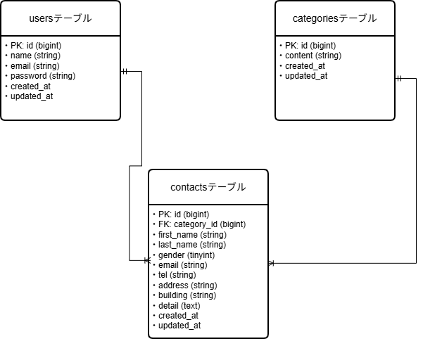

# FashionablyLate 管理システム

お問い合わせ管理機能を持つバックエンドシステムです。

## 環境構築

**Dockerビルド**
- git clone [リポジトリのURL]
- docker-compose up -d --build

**Laravel環境構築**
- docker-compose exec php bash
- composer install
- cp .env.example .env（環境変数を適宜変更）
- php artisan key:generate
- php artisan migrate
- php artisan db:seed

## 使用技術（実行環境）

- PHP 8.2.11
- Laravel 8.x
- MySQL 8.0.26
- Nginx 1.21.1
- Docker / Docker Compose

## ER図

- 開発環境：http://localhost/
- お問い合わせ画面：http://localhost/
- 管理画面ログイン：http://localhost/login
- ユーザー登録：http://localhost/register

## 機能一覧

- お問い合わせフォーム入力・確認・完了
- ログイン・ログアウト機能
- 管理画面：お問い合わせ一覧表示
- 管理画面：検索機能（名前、メール、性別、種類、日付）
- 管理画面：詳細モーダル表示
- 管理画面：データ削除機能
- 管理画面：CSVエクスポート機能