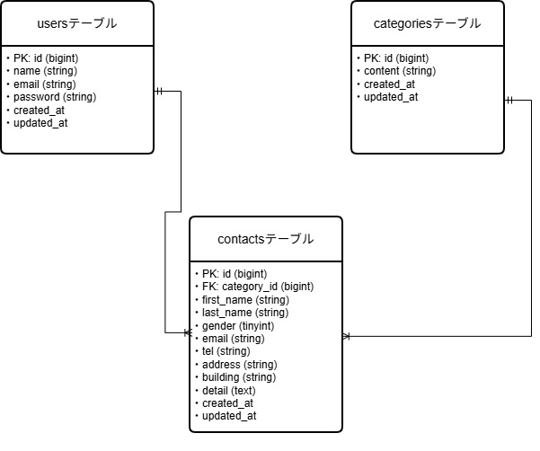

# FashionablyLate 管理システム

お問い合わせ管理機能を持つシステムです。

## 環境構築

### 1. リポジトリのクローンと起動
#### Dockerビルド
- git clone git@github.com:so-akemi/coachtech-test.git
- cd coachtech-test
- docker-compose up -d --build

### 2. Laravel環境構築
#### コンテナ内に入り、依存関係のインストールと初期設定を行います。
- コンテナ内に入る  
docker-compose exec php bash
- 依存関係のインストール  
composer install
- 環境設定ファイルの作成  
cp .env.example .env
- アプリケーションキーの生成  
php artisan key:generate

### 3. データベース接続設定と構築
####  .envファイルの設定  
※DB_HOST は 127.0.0.1 ではなく、Dockerサービス名の mysql を指定してください。

   <.envファイル>  
    DB_CONNECTION=mysql  
    DB_HOST=mysql  
    DB_PORT=3306  
    DB_DATABASE=laravel_db  
    DB_USERNAME=laravel_user  
    DB_PASSWORD=laravel_pass  

※.envファイルが権限エラーで保存できない場合は、以下コマンドを実施してください。(srcディレクトリ直下)

- sudo chown -R $USER:$USER .
- chmod 664 .env  
(コマンド実行後、ファイルの変更を保存してください)

#### 設定変更後はPHPコンテナ内にて下記コマンドを実行してください。
- php artisan config:clear
- php artisan cache:clear

#### マイグレーションとシーディングを実行  
- php artisan migrate:fresh --seed  
※エラーが発生した場合は、下記コマンドでコンテナ再起動後、再度php artisan config:clear～php artisan migrate:fresh --seedを実行してください。
- docker-compose down
- docker-compose up -d

### 4. ディレクトリ権限の設定
#### ファイルの書き込みエラーを防ぐため、コンテナ内の src ディレクトリにて以下の権限付与を実行してください。
- chmod -R 777 storage bootstrap/cache

## 使用技術（実行環境）

- PHP 8.2.11
- Laravel 8.x
- MySQL 8.0.26
- Nginx 1.21.1
- Docker / Docker Compose

## ER図

- 開発環境：http://localhost/
- お問い合わせ画面：http://localhost/
- 管理画面ログイン：http://localhost/login
- ユーザー登録：http://localhost/register

## 機能一覧

- お問い合わせフォーム入力・確認・完了
- ログイン・ログアウト機能
- 管理画面：お問い合わせ一覧表示
- 管理画面：検索機能（名前、メール、性別、種類、日付）
- 管理画面：詳細モーダル表示
- 管理画面：データ削除機能
- 管理画面：CSVエクスポート機能

## テスト用ログイン情報
データベース構築（`php artisan db:seed`）後、以下のユーザーと35件のテストデータが生成されます。
生成された以下のユーザーデータでログインして管理画面が確認できます。

- 管理画面URL：`http://localhost/admin`
- メールアドレス：test123@example.com
- パスワード：coachtech135